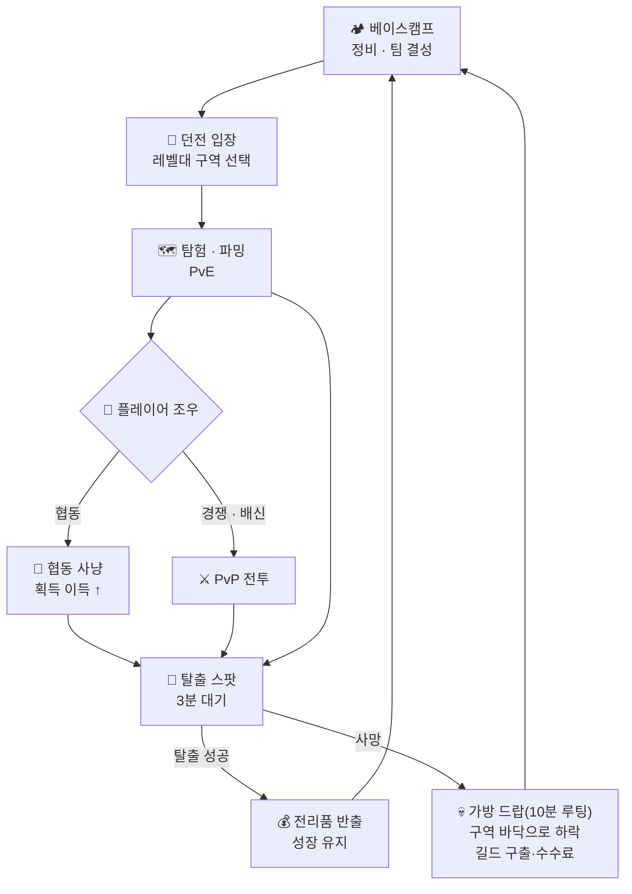

# 🎮 DungeonKing — 게임 컨셉 문서

> **작성 상태**: 핵심 컨셉 확정 완료. `❓`는 밸런싱/후속 단계에서 결정할 세부 항목입니다.
>
> **남은 항목 (밸런싱 단계에서 결정)**: 성기사 "배신자 처단" 효과 지속/쿨다운, 마킹 노출 범위(반경), 각종 스킬·스탯 밸런스

## 0. 설계 개선 결정 (v2 — 2026-07-17, /brainstorm 개선 세션)

디자인 리뷰(2026-07-17)가 짚은 3대 리스크를 다음과 같이 개선 확정.

| 축 | 이전 | 개선 결정 | 이유 |
|----|------|-----------|------|
| **사망 페널티** | 아이템+레벨+스킬포인트 **전부 상실**, 레벨 1로 초기화 | **진행 이원화** — 아이템만 상실, 레벨은 **현재 구역 바닥까지만** 하락, 스킬포인트 부분 보존. **길드 구출 수수료**(골드 싱크) | 4중 상실은 손실회피로 고레벨 유저 PvP 회피(턴틀링) 유발. 레퍼런스 게임도 진행 레이어는 보호함 |
| **동시 인원** | 심리스 **최대 30명** | 심리스 유지 + **12~16명으로 하향** | 심리스 30인 + 서버권위 FoW + 풀루팅 안티치트 = 인디 최악 조합. 재미(매복·배신)는 소규모에서 더 잘 성립 |
| **솔로/소셜** | 협동에 보너스 → 솔로 불리 | **솔로 = 1급 경로** ("고독한 길"): 솔로 전용 콘텐츠 + 자급자족 빌드. 협동은 **선택적 고천장 경로** | 협동 강제 시 솔로가 2등 시민. 솔로-안전 vs 파티-고위험의 **선택 자체**가 핵심 긴장이 됨 |
| **시체 루팅 (R4)** | "모든 아이템 소멸" | 사망 시 소지템이 맵에 **가방으로 드랍 → 10분간 타 플레이어 루팅 가능**, 이후 소멸 (다크앤다커식) | 킬에 보상(가방)을 부여해 PvP 성립 + 가방 쟁탈전이라는 새 긴장. 미회수분은 약한 싱크 |
| **인구 분산** | (신규 문제) 부분사망 = 상향 래칫 → **4구역 쏠림/하위 공동화** | **시즌 & 프레스티지제** — 시즌마다 진행 레이어 순환(하이브리드: 치장·프레스티지·일부 자원 영구 보존, 나머지 리셋) | 시즌 시작 시 전 구역 동시 재활성화. "이번 시즌 대륙 최강" = 코어 판타지 직결 |

> **R5(기어 존-게이팅)는 폐기**: 부분사망으로 죽은 베테랑이 하위 구역으로 되돌아가지 않으므로 "창고템 저구역 학살" 경로가 원천 차단됨.
> 상세는 §3(인원), §5 리스크, §5 **시즌 & 프레스티지**, §5 협동/배신, §5 **고독한 길** 참고.

## 1. 한 줄 소개 (Pitch)

플레이어들이 던전에 모여 **협동·경쟁·배신**을 넘나들며 아이템과 스킬을 파밍하고,
살아서 탈출하면 강해지지만 **죽으면 모든 것을 잃는** 하이리스크 하이리턴 PvPvE 던전 게임.

## 2. 핵심 재미 (Core Fun)

- **하이리스크 하이리턴**: 던전에서 얻는 성장은 크지만, 단 한 번의 죽음으로 가진 모든 것을 잃을 수 있다.
- **인간 심리의 긴장감**: 눈앞의 플레이어가 동료일지 배신자일지 알 수 없는 불확실성.
- **선택의 무게**: 협동할 것인가, 경쟁할 것인가, 배신할 것인가 — 매 순간의 판단이 결과를 가른다.

## 3. 장르 & 플랫폼

- **장르**: PvPvE 익스트랙션(탈출형) 심리스 오픈월드 던전 크롤러
- **플랫폼**: **PC 전용**
- **인원 & 구조**: **심리스 오픈월드** 방식. 던전 구역당 **12~16명**이 모여 파밍·전투
  (대규모 공존의 긴장감은 유지하되, 심리스 30인의 넷코드 리스크를 피한 현실적 규모 — §0 개선 결정 참고)
  - **입장은 자유**, 그러나 **탈출은 조건부** (아래 §5 탈출 시스템 참고) → 익스트랙션의 긴장감 유지
  - > ⚠️ 최종 인원은 Phase 0 넷코드 검증(서버권위 FoW 부하 실측)으로 확정. 여의치 않으면 인스턴스형으로 재설계 가능.
- **레벨 구역제 (매칭 분리)**: 던전을 레벨대별 **4개 구역**으로 세분화하여, 실력·성장 격차에 따른
  일방적 학살을 방지. 각 구역은 **성장 레벨 상한**이 있어 그 이상 성장 불가.

  | 구역 | 입장 레벨 | 성장 상한 |
  |------|-----------|-----------|
  | **1구역** | Lv 1~4 | Lv 4 |
  | **2구역** | Lv 5~8 | Lv 8 |
  | **3구역** | Lv 9~13 | Lv 13 |
  | **4구역** | Lv 14~18 | Lv 18 |

  - → **사망 시 현재 구역 바닥 레벨로만 하락**(구역 유지, §5 리스크 참고) — 하위 구역 강제 복귀 없음
  - → 하위 구역 재활성화는 **시즌 리셋**이 담당(§5 시즌 & 프레스티지). 학살 방지는 구역 상한 + 매칭 분리로 유지

## 4. 핵심 게임플레이 루프 (Core Loop)

1. **베이스캠프**: 보관 아이템 정비, (선택) 팀 결성 후 던전 입장
2. **던전 탐험**: 몬스터 처치 · 아이템/스킬 파밍 (PvE)
3. **플레이어 조우**: 협동 / 경쟁 / 배신 (PvP) — 던전 내 즉석 파티 결성·**배신(이탈)** 가능
4. **탈출(익스트랙션)**: 탈출 스팟에서 길드에 탈출 신호 → **약 3분 대기** 후 탈출
5. **결과**:
   - 성공 → 획득물을 베이스캠프로 반출, 성장 유지
   - 사망 → **소지템 가방 드랍(10분 루팅 가능) + 레벨은 현재 구역 바닥으로 하락** (스킬포인트 부분 보존, 베이스캠프 보관분 안전, 길드가 구출·수수료 부과 — 상세 §5 리스크)

## 5. 주요 메커니즘 (Mechanics)

### 전투 & 조작
- **시점**: 탑다운 뷰 고정 (League of Legends 스타일)
- **이동**: WASD 키보드 이동
- **기본 공격**: 마우스 **우클릭**으로 대상(오브젝트) 선택 시 기본 공격 시전
- **스킬 키**: `Shift`, `Q`, `E`, `R`, `Z`, `X`
- **스킬 유형별 시전 방식**:

  | 유형 | 시전 방식 |
  |------|-----------|
  | **버프형** | 키를 눌렀다가 **떼는 순간 즉발** |
  | **타겟형** | 스킬키를 **누른 상태 + 마우스 좌클릭**으로 대상 지정 시전 |
  | **논타겟 범위기** | 키를 누르면 캐릭터 주위에 범위 표시(**본인에게만 보임**), 키를 떼면 시전 |

### 시야 시스템 (전장의 안개 & 부시)
- 탑다운 시점의 열린 시야를 보완하기 위해 **전장의 안개(Fog of War)** 도입
- **부시(수풀)** 시스템으로 매복 지점 제공 (League of Legends 방식)
- → 기습·매복·배신이 실제로 성립하도록 **시야를 전략 자원**으로 만듦 (배신 재미와 직결)

### 스킬 = 장비 종속 시스템 (핵심)
- 스킬은 **아이템(장비)에 부착**되어 있음 → **아이템을 바꾸면 해당 스킬이 바뀜**
- 스킬과 키의 대응은 **착용 부위**에 따라 결정됨:

  | 장비 부위 | 대응 |
  |-----------|------|
  | **무기** | 기본 공격 · `Shift` · `R` |
  | **모자(머리)** | `Q` |
  | **신발** | `E` |
  | **상·하의** | `Z` · `X` |

- → 어떤 장비를 조합하느냐가 곧 **빌드**가 됨 (파밍한 장비 조합 = 스킬 세트)

### 클래스리스 빌드 (정체성)
- **고정 직업 없음**: 전사·마법사·암살자·성기사는 "직업"이 아니라 **장비 계열**
- 어떤 장비를 입고 어떤 스킬을 쓰느냐에 따라 **플레이 컨셉이 자유롭게 변형**
- 장비마다 **능력치 증가 스탯**이 붙어 있어, 계열을 섞으면 하이브리드 빌드가 가능
  - 예) 마법사 무기(근접 마법 공격력) + 전사 모자(HP 증가 버프) + 암살자 옷·신발(이동속도)
    → **이동속도 빠른 원거리 공격형 탱커**
- **특화 vs 균형의 트레이드오프**:
  - 마법사 계열로 **올인**하면 막강한 마법 데미지, 그러나 **HP·방어력·이동속도가 취약**
  - 조합에 따라 강점과 약점이 명확히 갈리도록 설계

### 계열 세트 효과
- 같은 계열 장비를 **여러 부위 맞춰 착용**하면 **세트 효과** 발동
- → 짜깁기(best-in-slot) 하이브리드만 정답이 되지 않도록, **특화 빌드에 보상**을 부여하여 밸런스 유도
- **계열별 세트 방향성 (예시)**:

  | 계열 | 세트 지향 |
  |------|-----------|
  | **전사** | 근접 지속 딜 · 생존력 |
  | **마법사** | 강력한 원거리/광역 마법 딜 (물몸) |
  | **암살자** | 고기동 · 순간 폭딜 · 기습 |
  | **성기사 (서포터/탱커)** | **극단적 탱킹** — 풀세트 시 어떤 스킬을 맞아도 **잘 죽지 않음**, 단 **공격 스킬 사용 불가** |

#### 성기사 시그니처: "배신자 처단"
- **발동 조건**: 성기사 **세트 효과 충족(풀세트)** 시 사용 가능한 특수 효과
- **효과**: **일정 시간 동안**, 성기사의 **모든 버프·치유 스킬이 "배신자"에게는 반대로 적용**
  - 이동속도 증가 버프 → **이동속도 저하**
  - 치유 스킬 → **피해(데미지)**
- **의미**:
  - 공격 스킬이 없는 성기사에게 **배신자 한정 대응 수단**을 부여 → 배신당해도 무력하지 않음
  - "배신은 자유지만, 성기사 앞에서의 배신은 대가가 따른다"는 **협동 장려 철학의 상징적 장치**
- **배신자 낙인 (v2: 로컬 판정)**: 배신(파티 이탈) 후 **일정 시간, 배신당한 이전 파티원에게만** "배신자"로 표시 (전역 낙인 아님 — 무관한 제3자에겐 평범한 플레이어). 성기사 "배신자 처단"은 *자신이 배신당한 대상*에게 성립
- ❓ 세부: 로컬 낙인 지속 시간, 효과 지속/쿨다운 수치 (밸런싱 단계에서 결정)

### 성장 (레벨 & 스킬 포인트)
- **레벨**: 던전에서 경험치를 얻어 성장, **최대 18레벨**
- **레벨 보상**: 1레벨당 **스킬 포인트 1** 획득
- **스킬 포인트 용도**: `Shift`/`Q`/`E`/`R`/`Z`/`X`에 배정된 **스킬의 레벨 강화**
- **아이템·전리품**: 탈출에 성공하면 던전에서 얻은 **모든 것을 그대로 반출** 가능
- **구역별 성장 상한**: 현재 구역의 상한 레벨까지만 성장 가능 (상세는 §3 레벨 구역제 참고)

### 탈출 (익스트랙션 시스템)
- **개념**: 탈출은 **길드에 던전 밖으로의 텔레포트를 요청**하는 행위 (세계관과 연동)
- **입장은 자유**지만 **탈출은 즉시 불가** — 아무 때나 나갈 수 없음
- **탈출 절차**:
  1. **탈출 구역(스팟)**으로 이동
  2. **파티 전원이 탈출 구역 안에 함께 있을 때** 탈출 상호작용이 **활성화**
  3. 파티원 한 명이 탈출 스팟 **한가운데의 석탑**에서 **전서구를 길드로 날려보냄** (텔레포트 요청)
  4. 이후 시전자는 석탑에 **마력을 계속 흘려보내** 길드에 자신들의 위치를 노출시키는 **"마킹"**을 유지
  5. **약 3분간 마킹 유지** → 길드의 텔레포트로 던전 밖으로 탈출 완료
- **탈출 실패 조건**:
  - 마력을 흘려보내던 **시전자가 피격당하거나**, **마력 주입을 중단**하면 → **탈출 실패**
  - → 시전자는 그동안 **고정·무방비** 상태, 나머지 파티는 그를 **3분간 지켜내야 함** (수성전 구조)
- **배신 발생 시 처리**:
  - 파티에서 배신자가 나와도 **남은 파티원의 진행 중이던 탈출은 그대로 이어짐**
  - **배신자 본인은 탈출 진행 매커니즘이 초기화** → 탈출 진행이 끊김 (파티 탈출에 무임승차 불가)
- **긴장 요소**:
  - 마킹은 **위치를 계속 노출**시키므로, 3분간 습격·배신 위험에 그대로 노출됨
  - **파티 전원 집결 + 시전자 무방비** 조건 때문에 탈출 구역은 **매복·기습의 좋은 표적**
  - → "언제, 어디로 탈출을 시도할 것인가"라는 판단 자체가 핵심 리스크가 됨
- **탈출 석탑 배치**: 맵에 **여러 개가 고정·상시 공개** → 어느 석탑으로 갈지 선택지가 생기고,
  석탑 주변이 자연스럽게 **쟁탈·매복의 명소**가 됨
- **마킹 노출 범위**: 마킹 시전 시 **근처 일정 범위의 다른 플레이어에게도 위치가 표시** →
  탈출 시도가 곧 "여기 전리품 든 파티 있다"는 **어그로 신호**가 되어 긴장감 극대화

### 리스크 (로스트 시스템 — 하드코어는 아님) *(v2 개선: 진행 이원화)*

**설계 원칙**: 진행을 **두 레이어로 분리** — *휘발 레이어(던전 반입물)*는 잃고, *진행 레이어(레벨·스킬)*는 부분 보존. (다크앤다커의 특성/창고, 타르코프의 하이드아웃과 같은 철학)

- **사망 시 (개선안)**:
  - **시체 루팅 (R4 확정)**: 소지·장착 중이던 **모든 아이템이 맵에 "가방(백팩)" 형태로 드랍** → 다른 플레이어가 **10분간 루팅 가능**, 10분 경과 시 가방(및 미회수 아이템) **소멸**. (다크앤다커식) 피해자는 반입물 전부를 잃되, 아이템은 *파괴가 아니라 경제에 재순환*
  - 레벨은 **현재 구역 바닥으로만** 하락 (예: 4구역 Lv17 사망 → Lv1이 아니라 **Lv14로**) — 긴 등반을 통째로 날리지 않음
  - **스킬포인트는 부분 보존** (전액 소실 X) → 빌드 정체성이 죽음마다 리셋되지 않음
  - 캐릭터는 **길드에 의해 베이스캠프로 구출** → 완전 사망(퍼머데스) 아님
  - **길드 구출 수수료(골드)** 부과 → 이분법적 파멸을 *등급형 경제 비용*으로 전환 + **핵심 골드 싱크** 역할 (세계관의 길드 로어와 직결)
- **(선택) 보험**: 입장 전 특정 템에 보험을 걸어 사망 시 일부 회수 가능 — "얼마나 지킬까"의 추가 다이얼
- **베이스캠프 보관 아이템은 안전** → "얼마나 챙겨 들어갈지 vs 잃을지"의 도박적 판단 유도
- ❓ 세부 수치(구역별 하락 폭, 스킬포인트 보존율, 구출 수수료, 보험료)는 밸런싱 단계에서 결정

### 시즌 & 프레스티지 (v2 신규 — 인구 순환)

**해결하는 문제**: 부분사망은 "상향 래칫"이라 시간이 지나면 활성 유저가 **4구역에 고이고 하위 구역이 공동화**됨. 시즌제로 인구를 주기적으로 재분산한다. 게임의 코어 판타지 *"누가 대륙 최강인가"* 를 *"누가 **이번 시즌** 최강인가"* 로 만들어 반복 스테이크를 부여.

- **작동**: 시즌 시작 시 활성 유저가 다 같이 하위 구역부터 재출발 → **전 구역 동시 재활성화** → 시즌 내내 재등반(자연스러운 성장 아크).
- **시즌 래더**: 시즌 단위 랭킹. 종료 시 랭크 확정 → 시즌 보상 → 리셋. 코어 판타지를 직접 구현.
- **프레스티지 (선택적 하향)**: 정점 도달 유저가 시즌 종료 전에도 **자발적 레벨 리셋** 가능 → 영구 프레스티지 랭크/치장 보상. 정점 유저에게 상시 순환 동기 부여.
- **리셋 범위 (하이브리드 확정)**:
  - **영구 보존(계정 레이어)**: 치장(코스메틱), 프레스티지 랭크, **일부** 계정 자원/언락
  - **시즌 리셋(시즌 레이어)**: 캐릭터 레벨·스킬포인트, 시즌 래더 랭크, **대부분의** 창고 자산(시즌 격리 또는 부분 리셋)
  - → 매 시즌 "거의 새 출발"에 가깝되, 정체성(치장·랭크)은 이어지는 중간 지점
- ❓ 세부(시즌 길이 4~8주?, 영구 보존 자원의 정확한 범위, 프레스티지 보상, 래더 보상 구조)는 밸런싱/라이브옵스 단계에서 결정

### 협동 / 배신 & 파티 시스템
- **팀 결성 시점**:
  - 베이스캠프에서 미리 팀을 짜고 함께 입장 가능
  - 던전 내에서 다른 캐릭터와 **즉석 파티 결성 가능**
- **파티 규칙**: 파티가 맺어진 동안에는 **서로 공격 불가**(아군 오사 없음)
- **파티 이탈 = "배신"**: 파티에서 나가는 행위 자체를 UI/시스템상 **"배신"으로 명명**
  - 중립적 "탈퇴"가 아니라 **"배신"**이라는 단어로 표기하여, 이탈 행위에 **심리적 무게**를 부여
  - 언제든 배신 가능하지만, 그 행위가 **이율배반적으로 느껴지도록** 의도적으로 연출
  - → 파티를 맺는 순간부터 "이 사람이 언제 배신 버튼을 누를까"라는 사회적 긴장이 상시 작동
- **협동의 이점**:
  - 몬스터·고립된 플레이어를 **더 쉽게 사냥**
  - **협동 상태로 플레이어/중립 몬스터를 처치하면 획득 이득이 더 커짐** (협동 장려 보상)
- **배신의 방식** (시스템 보상 없음, 순수 재미):
  - 파티 탈퇴 후 **파티의 전리품을 챙겨 도주**
  - 강력한 몬스터의 **어그로를 파티에 떠넘기고 도주**
- **설계 철학 (v2 개선: 솔로-파티 대칭)**:
  - **기본값을 강제하지 않음** — 솔로/협동/배신 모두 플레이어의 자유
  - 협동은 **강제가 아니라 "높은 천장을 원할 때의 선택"** — 파티는 정예 몬스터·대형 금고 등 *고가치 콘텐츠 접근*과 *수성전 안전*을 얻지만, **전리품 분배 + 배신 리스크 + 집결·의사결정 오버헤드 + 큰 탐지 노출**을 감수
  - 솔로는 **완전한 대칭 경로** — 아래 "고독한 길" 참고. 전리품 독식 + 은신 + 배신 리스크 0
  - → **핵심 긴장은 "솔로-안전 vs 파티-고위험" 선택 그 자체**에서 발생. 배신은 이 선택 구조 위에서 자연스러운 리스크가 됨
  - 배신은 별도 시스템 페널티 없이 **순수한 플레이어의 선택/재미**로 남겨둠 (단, ❓ "farm 후 배신" 익스플로잇 방지책은 밸런싱 단계 검토 — 예: 협동 보너스를 공동 탈출 성공 시 정산)

### 고독한 길 (솔로 플레이) *(v2 신규)*

솔로를 **1급 플레이 경로**로 승격. 파티와 우열이 아니라 **다른 리스크/보상 프로필** — "유령처럼 숨어 혼자 다 챙긴다"는 정체성.

- **솔로 고유 이점 (자연 발생)**:
  - **전리품 독식**: 나눌 사람이 없으니 100% 획득
  - **은신 우위**: 1인은 소음·발자국·크기가 작아 **전장의 안개/부시에 훨씬 덜 노출** → 시야 시스템이 솔로 강점으로 작동
  - **배신 리스크 0 · 즉각 판단**: 집결/합의 없이 언제든 자기 페이스로 탈출 시도
- **솔로 전용 콘텐츠 (S-4)**:
  - **1인 전용 균열·통로**: 파티는 물리적으로 못 지나가는 좁은 길 → 던전에 **솔로 레인**(지름길·매복로·은밀 탈출로)이 별도 존재
  - **고독의 사당**: 혼자일 때만 발동, 파티원 있으면 봉인 — 고유 버프·희귀 전리품
  - **1인 시련방/금고**: 솔로 전용 챌린지. 파티 정예 콘텐츠와 **가치는 대등하되 종류가 다름** (파티=물량, 솔로=고유·희귀)
  - **세계관 연동**: "고독한 모험가에게만 응답하는 유물" — 로어로 정당화
- **자급자족 빌드 (S-5)**:
  - 클래스리스 시스템에 **솔로 생존형 아키타입**(자힐 브루저, 고기동 암살자)을 명확히 마련 → 힐러 없이 굴러감
  - 세트 효과에 **솔로 지향 시너지** 추가 (예: "주변에 아군 없을 때 지속력↑")
  - 대칭적으로 성기사(공격 불가 극탱)는 명백히 **파티 지향** → *"어떤 빌드를 입느냐 = 어떤 플레이스타일을 고르느냐"* 성립
- ⚖️ **밸런스 과제**: 솔로 전용 보상 ↔ 파티 정예 보상은 *가치 대등, 종류 상이*하게 유지 (한쪽 지배 방지) — 밸런싱 단계 핵심 숙제

## 6. 세계관 & 분위기 (Setting / Tone)

- **톤**: **중세 판타지**
- **클래스/스킬 계열**: 전사 · 마법사 · 암살자 · **성기사**(서포터/탱커 — 기존 힐러를 통합)
- **배경 스토리**:
  - 하나의 대륙에서 **내로라하는 모험가들**이, 대륙 **중심의 거대한 던전**에 모여
    **누가 이 대륙 최강인지**를 겨룬다.
- **게임 내 공간 구성**: **던전** + 던전 주위의 모험가 **베이스캠프**
- **길드 (던전 관리 조직)**:
  - **베이스캠프에서의 모험가 간 전투를 엄격히 금지** (안전지대 역할)
  - 던전 안에서 죽은 모험가를 **구출**
  - 던전 전리품을 **매입 → 재판매**하거나 직접 사들이는 **시장(경제) 역할**

## 7. 타겟 유저 & 레퍼런스

- **레퍼런스 게임**:
  - Dark and Darker (익스트랙션 던전 + 하이리스크 로스트)
  - League of Legends (탑다운 전투 조작)
  - 배틀그라운드 (대규모 인원이 한 공간에서 상호작용 — 단, 입장 자유/조건부 탈출로 변형)
- **타겟 유저**:
  - **핵심 타겟**
    - **익스트랙션 팬**: 다크앤다커·타르코프의 "잃을 수도 있다"는 긴장을 즐기되,
      **탑다운 MOBA 조작**을 더 선호하는 층
    - **하드코어 PvP 유저**: 실력·판단으로 이기는 쾌감을 즐기고 로스트 리스크를 감수하는 층
  - **서브 타겟**
    - **MOBA(LoL·도타) 유저** 중 성장·파밍·PvE 결합 경험을 원하는 층
    - **사회적 심리전 애호가**: 어몽어스·러스트처럼 배신·신뢰의 드라마에 끌리는 층
  - **한 줄 정의**: "MOBA 조작에 익숙하면서, 한 판의 무게가 무거운
    **하이스테이크 심리전**을 원하는 코어 게이머"

## 8. 차별점 (USP)

- **핵심 차별점**: **하이리스크 하이리턴 익스트랙션** 게임성과
  **League of Legends식 탑다운 전투 조작**의 교차
  - 기존 익스트랙션 게임(다크앤다커·타르코프)은 1인칭/3인칭 슈팅·근접 위주
  - 여기에 **MOBA식 스킬 조작감(우클릭 평타 + 부위별 스킬)**을 결합해 차별화
- **클래스리스 빌드 자유도**: 고정 직업 없이 **장비 조합으로 컨셉을 창조**하는 플레이
- **입장은 자유·탈출은 대가(3분 대기)** 심리스 던전 + **상시 배신 가능**에서 오는 사회적 긴장감
